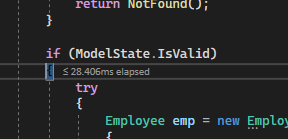
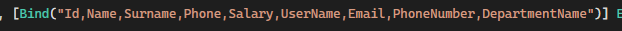
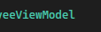
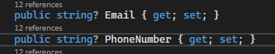

 bundaki isvalid false hatası!  bundan dolayı değil.  deki  soru işareti(?) olmayan yerden dolayı kaynaklanıyormuş. yani verimodelini yazdığın class için sade bir şey tutabilirsin ama viewmodel kullanırken bunu yapmak zorunda olmadığın gibi view model de bu validasyon atributları kullanmanın baya da bir faydası olabilir.